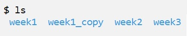

## Command Line Course

This course was an introduction to command-line tools, aimed at linguists. During the course we learned to use the Unix command-line and perform various tasks. We learned the basics of Regular expressions, Python virtual environments and using version control. A more in depth description of the course can be found [here](https://courses.helsinki.fi/fi/KIK-LG219/129824412).

##### Week 1: Introduction to Command Line Environments

Starting at the very basics, we learned how to run a command-line environment on our personal computers and how to navigate the Unix environment. We practiced creating, moving and removing files and directories, and started getting familiar with some text editors on the command-line, such as Emacs. We also learned how to download files with `wget`.

I had previously used command-line in some of my courses, so the basic file managemen commands were somewhat familiar to me, even if I had mostly forgotten about them. Working on command-line, one of the significant aspects is definitely the lack of graphical user interface. It stroke me especially once we started editing files on Emacs. Remembering the key combinations for moving around the file efficiently and editing it felt very difficult.

##### Week 2: Navigating a UNIX System

On the second week we kept diving in deeper to the Unix system, learning more about it's structure, symbolic links, privacy and processes. We learned how to compress and decompress files and directories with `gzip` and `tar` and how to change file permissions with `chmod`. We also practiced forming a remote connection to a server.

The content of this week felt basic but important.

##### Week 3: Basic Corpus Processing

While the first 2 weeks focused on getting used to working with the Unix environment, on the third week we started to see what use it can be to linguists. We learned about character encodings and processing text files. We were introduced to many commands used for processing text files. Here is a small list of examples.

Command | Description
--- | ---
wc | Counts lines, words or bytes in a text file.
uniq | Removes repeated identical lines from a text file.
sort | Sorts lines in a text file to alphabetical or numerical order.
tr | Transforms specified characters into other characters, e.g. upper case letters to lower case letters.

We started getting familiar with Regular Expressions, and how to use them in text processing with the `grep`command. We also learned about formatted text files such as csv and tsv files.

This week things started getting more concrete. I had dabbled in processing text files in command-line before, so I was somewhat familiar with the concepts, but I definitely needed a refresher. I remember struggling with Regular Expressions in the past as well. The information about character encodings was really interesting, even though it took some time to wrap my head around it.

##### Week 4: Advanced Corpus Processing

Following the basics of corpus processing, we learned to pipe simple commands together to complex command pipelines. Now, instead of just sorting the file in alphabetical order or counting the lines, we could easily create a word frecuency list or a lost of word n-grams.

We also learned about `sed`, which can be used to quickly edit files without opening them and has a lot of usages in corpus processing. Example usages of `sed`:
* finding and replacing strings
* insertion or deletion
* search

Building pipelines from simple commands and accomplishing more complex tasks was fun. At this point most of the basic commands were  starting to be in muscle memory and exiting text editors didn't require checking the cheatsheet.

##### Week 5: Scripting and Configuration Files

This week we took yet another step and started creating scripts instead of typing the commands out one by one. We also learned about environment variables and configuration files in Unix.

This week was a lot of fun. We created our own .bashrc files to configure our own working environments. We were free to do what we wanted, which got me exploring the possibilities. I wanted to change the colors that directories and files were listed with when running the `ls` command. I quickly found out how to do it, but for some reason I couldn't change the ugly green color of directories.

Finally I found out that the color wasn't only dependent on file type, but also the permissions. So I had to specify that also the directories with certain permissions should be a different color. With that I was able to change the colors to ones I liked. While I was at it I created an alias for `ls --color` so that `ls` would always give a colored output.

    # Nice colors for ls  
    LS_COLORS='di=36:ln=35:ex=35:tw=36:ow=36' ;  
    export LS_COLORS

    # Colorize the ls output
    alias ls='ls --color=auto'

##### Week 6: Installing and Running Programs

The theme of the week was installing programs, and we definitely did do some installations this week. The dependencies seemed to pile up on eachother, and one program needed another one, one thing needed a library I didn't have and so on. It felt very complicated compared to how installing programs on Windows works. I'm still not sure what happened. However I learned how to use `sudo` to temporarily become the root user in order to install programs, and how to look for software with `apt-get`.

This week also included Python virtual environments and packages, and makefiles. It was good to learn Python virtual environments exist, but I feel it was a little bit disconnected to the rest of the course. When it comes to makefiles, I wish there was a "Makefiles for dummies" tutorial. I felt looking for information on them online was hard, as the examples seemed so different from the things we were working on. Still, I managed to complete the exercises and it felt really goood.

##### Week 7: Version Control

On the last week we learned about version control using Git, and managing the Git repositories in GitHub. We learned to add files in our local repository with `git add`, commit the changes with `git commit` and push the changes to the global repository on GitHub. We also learned to create and use branches for working on different features in the projects.

I feel I grasped the basics of using Git, but it still seems a little tedious. It could be because the whole workflow is still very new to me, and it takes time because of that. I understand the usefulness of Git when there are many people working on the same project, but working alone it seems like a lot of extra work for nothing. I suppose if I had a big project it would be useful, but so far everything I've done has been quite simple.

##### Final Project

We had generous time to work on the final project, so of course I started the night before deadline. Once I got into the flow, the project, as all the exercises so far, was interesting and a lot of fun. One thing about this course that has been especially nice, is how it has given me dozens of small aha moments. Reading the material about Markdown, I understood why typing words \*inside asterisks\* in Discord always turns them to *italics*. These small things make me feel like the things I'm learning actually mean something.

The final project was good practice in using Git. I feel it wasn't as challenging as some of the exercises, but that wasn't a bad thing. It did require some problem solving, and definitely time. 

All in all I really enjoyed the course and I'm really happy I took it. I'm sure it will prove very useful to me in the future.