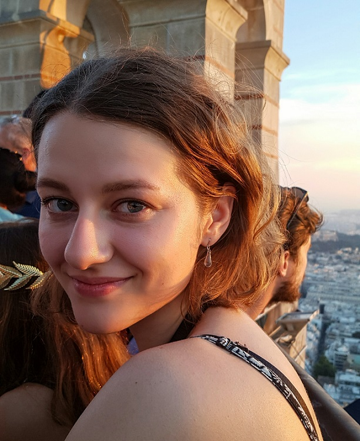

## Introduction 

I am a bachelor degree student in Helsinki University. I am majoring in general linguistics and minoring in Asian studies, specializing in Japanese. I am currently working on my BA thesis.

[CV](assets/documents/Mira_CV.pdf)

## Find me on

[GitHub](https://github.com/mirajulia), [Facebook](https://www.facebook.com/mirajuliak)

## Contact

My email address is of the form first_name.last_name@helsinki.fi. 

## Courses I've Taken

[Morfologian ja syntaksin jatkokurssi](https://courses.helsinki.fi/fi/KIK-LG202/129823483), fall 2019

[Fonologian jatkokurssi](https://courses.helsinki.fi/fi/KIK-LG201/129823259), fall 2019

## Projects

[cmdline-course](https://github.com/mirajulia/cmdline-course)

## Misc. 

[Emacs command list](https://people.ast.cam.ac.uk/~vasily/idl/emacs_commands_list.html)

[Advent of Code](https://adventofcode.com/)
